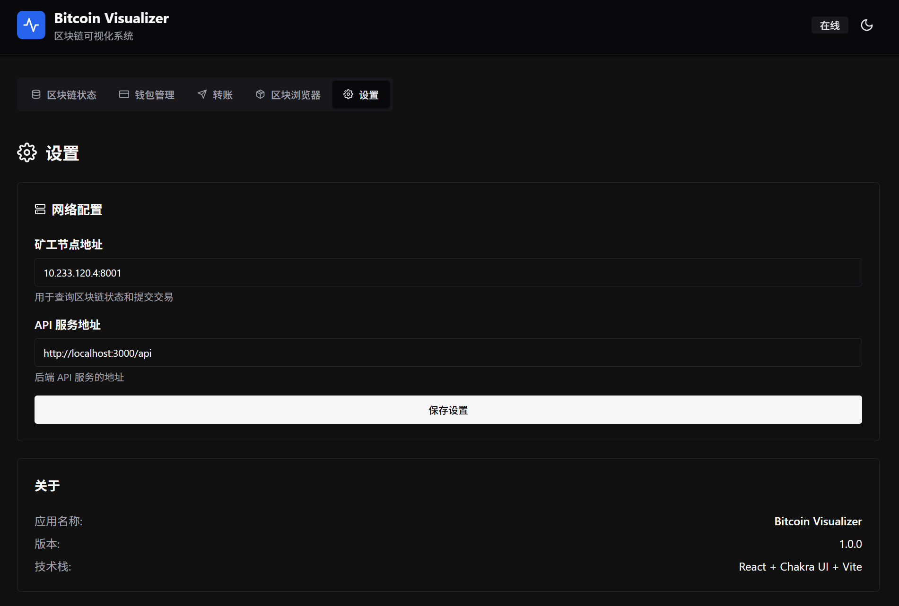
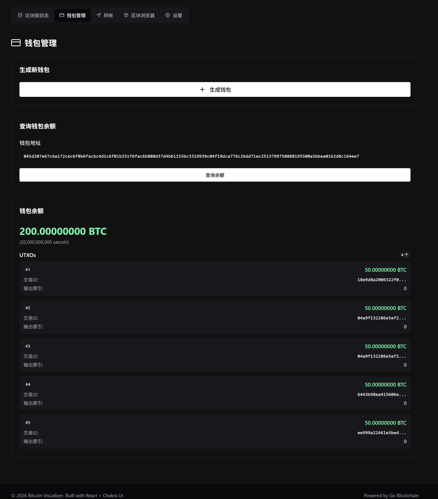
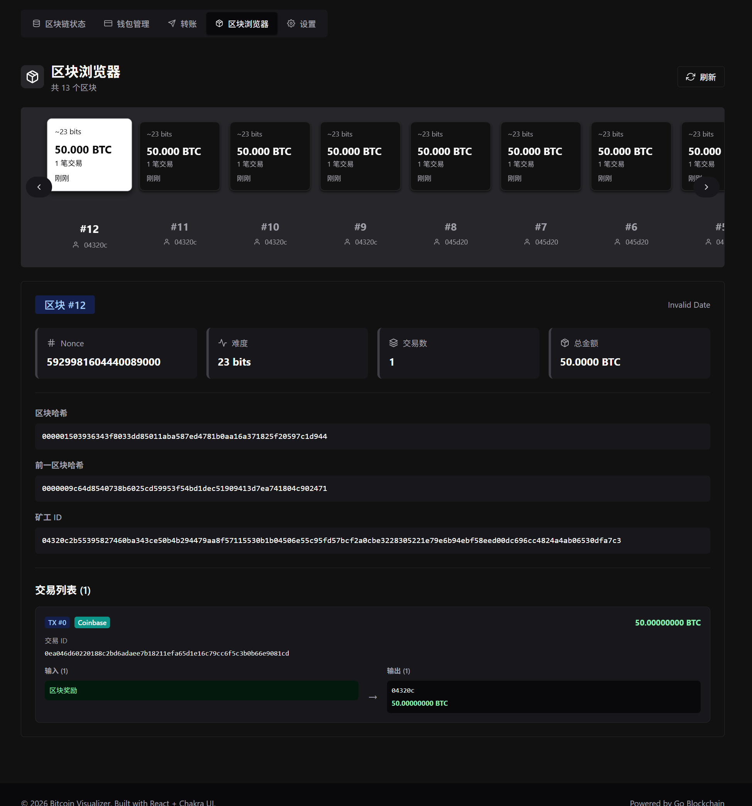
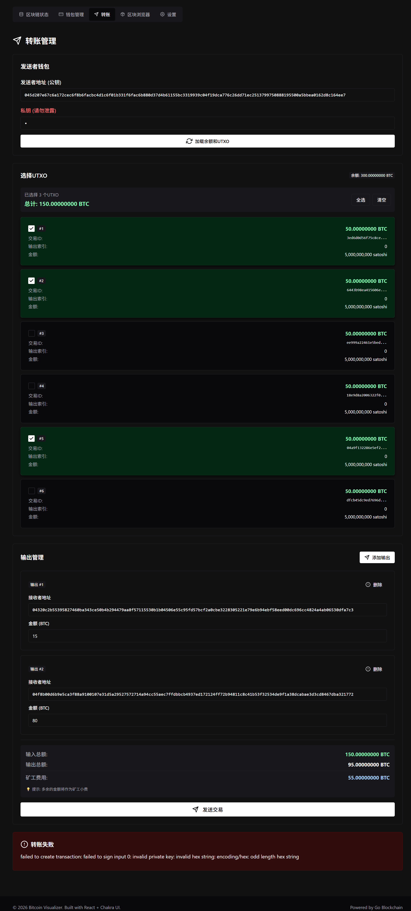

**The report is in docs/.**

# Build and Run Instructions

This document provides instructions for building and deploying the Bitcoin-like blockchain implementation.

## Prerequisites

- Go 1.21 or later
- Python 3.x (for evaluation scripts)
- SSH access to miner nodes (for distributed deployment)
- Make (build tool)

## Project Structure

```
.
├── cmd/
│   ├── client/         # Client CLI application
│   ├── miner/          # Miner node application
│   └── fakeminer/      # Malicious miner for testing
├── pkg/
│   ├── block/          # Block data structure
│   ├── blockchain/     # Blockchain implementation with UTXO
│   ├── config/         # Global configuration (Merkle tree flag)
│   ├── merkle/         # Merkle tree implementation
│   ├── network/        # P2P networking and RPC
│   ├── pow/            # Proof of Work algorithm
│   └── transaction/    # UTXO-based transaction handling
├── test/               # Integration tests
├── eval/               # Performance evaluation scripts
├── WebUI/              # React-based visualization frontend
├── minerip.txt         # Static list of miner IP addresses
└── Makefile            # Build and deployment automation
```

## Building

### Compile All Binaries

```bash
make compile
```

This builds three binaries in the `bin/` directory:
- `bin/miner` - The miner node
- `bin/client` - The client CLI tool
- `bin/fakeminer` - A malicious miner for testing

### Build Individual Components

```bash
# Build miner only
go build -o bin/miner ./cmd/miner

# Build client only
go build -o bin/client ./cmd/client

# Build fakeminer only
go build -o bin/fakeminer ./cmd/fakeminer
```

## Network Configuration

### Static Miner Network

**Important**: This project assumes a **static network**. The miner IP addresses are **manually pre-configured** in `minerip.txt`. The network does not support dynamic miner joining or leaving.

The `minerip.txt` file contains one IP address per line:
```
10.233.120.4
10.233.93.201
10.233.102.215
10.233.93.195
10.233.120.8
...
```

The Makefile reads this file and uses the first `COUNT` IPs for deployment. Each miner is configured with all other miners as peers (full mesh topology).

## Deployment

### Deploy Miners to Remote Nodes

The main deployment target is `make deploy_miner`. This command:

1. Stops any existing miners on the target nodes
2. Compiles the miner binary
3. Generates a wallet for each miner
4. Copies the binary to each remote node via SCP
5. Starts the miner process with the correct peer list

```bash
# Deploy 5 miners with difficulty 23
make deploy_miner COUNT=5 DIFFICULTY=23

# Deploy 3 miners with difficulty 18
make deploy_miner COUNT=3 DIFFICULTY=18
```

**Parameters:**
- `COUNT` - Number of miners to deploy (uses first N IPs from minerip.txt)
- `DIFFICULTY` - Mining difficulty (number of leading zero bits required)

**What happens during deployment:**

1. The Makefile reads `minerip.txt` and selects the first `COUNT` IPs
2. For each selected IP:
   - A wallet is generated using `./bin/client wallet`
   - The wallet is saved to `logs/wallets/wallet_<IP>.json`
   - The peer list is constructed (all other selected IPs with port 8001)
   - The miner binary is copied to `/osds_project2/miner` on the remote node
   - The miner is started with:
     ```bash
     nohup /osds_project2/miner -id <wallet_address> -address 0.0.0.0:8001 \
         -peers '<peer1>:8001,<peer2>:8001,...' -difficulty <DIFFICULTY> \
         > /osds_project2/miner.log 2>&1 &
     ```

### Stop All Miners

```bash
make stop_miner
```

### Download Miner Logs

```bash
make download_log COUNT=5
```

Logs are saved to `logs/download/miner_<IP>.log`.

## Running Locally

Use `-help` for detailed information.

### Start a Local Miner

```bash
./bin/miner -id miner1 -address localhost:8001 -difficulty 4 \
    -peers localhost:8002,localhost:8003
```

**Miner Flags:**
- `-id` - Miner ID (typically the wallet address)
- `-address` - Address to listen on (e.g., `localhost:8001`)
- `-difficulty` - PoW difficulty (number of leading zero bits)
- `-peers` - Comma-separated list of peer addresses
- `-merkle` - Use Merkle Tree for block hash (default: true)
- `-dynamic-difficulty` - Enable dynamic difficulty adjustment (default: false)
- `-threads` - Number of parallel mining threads (default: 1)

### Using the Client

#### Generate a New Wallet
```bash
./bin/client wallet
```

#### Check Blockchain Status
```bash
./bin/client blockchain -miner <ip>:8001
./bin/client blockchain -miner <ip>:8001 -detail  # Include block details
```

#### Check Balance
```bash
./bin/client balance -address <wallet_address> -miner <ip>:8001
```

#### Query UTXOs
```bash
./bin/client utxo -address <wallet_address> -miner <ip>:8001
```

## Performance Evaluation

The `eval/perf.py` script automates performance benchmarking:

```bash
cd eval
python3 perf.py --counts 1,3,5 --difficulties 15,18,20 --duration 120
```

This will:
1. Deploy miners with various configurations
2. Measure blocks mined over a fixed time window
3. Save results to `logs/perf/<timestamp>/`
4. Generate performance charts

## Test Scripts

### demo.sh

A demonstration script that shows basic blockchain operations:

```bash
./demo.sh
```

### test_merkle_performance.sh

Compares block generation rate with and without Merkle tree:

```bash
./test_merkle_performance.sh
```

This script deploys miners in both modes and measures the number of blocks mined in a fixed time window.

### test_parallel_mining.sh

Tests parallel mining performance with different thread counts:

```bash
./test_parallel_mining.sh
```

This script deploys single-miner instances with 1, 2, 4, and 8 threads, measuring blocks mined in a fixed duration.

## WebUI

A React-based visualization interface is available in the `WebUI/` directory.

### Setup WebUI

```bash
# Install Node.js environment
make environment

# Or manually:
cd WebUI
pnpm install
pnpm dev
```

### Running WebUI

Then, change the directory to `WebUI`. Execute
```bash
node api-server.mjs
```
and
```bash
pnpm dev
```
separately. You may see an application running on some port (the port number is shown along with the `pnpm` command), that is the frontend.



At the very begining, you should set the miner address manually.

The WebUI provides:

- Blockchain status dashboard

  

- Wallet management

  

- Block explorer

  

- Transaction transfer interface

  

## Troubleshooting

### SSH Connection Issues
Ensure SSH keys are set up for passwordless access to miner nodes:
```bash
ssh-copy-id root@<miner-ip>
```

### Miner Not Starting
Check the remote log:
```bash
make download_log
```
or
```bash
ssh root@<miner-ip> "cat /osds_project2/miner.log"
```

### Missing minerip.txt
Create the file with one IP address per line. Ensure these nodes are accessible via SSH.
